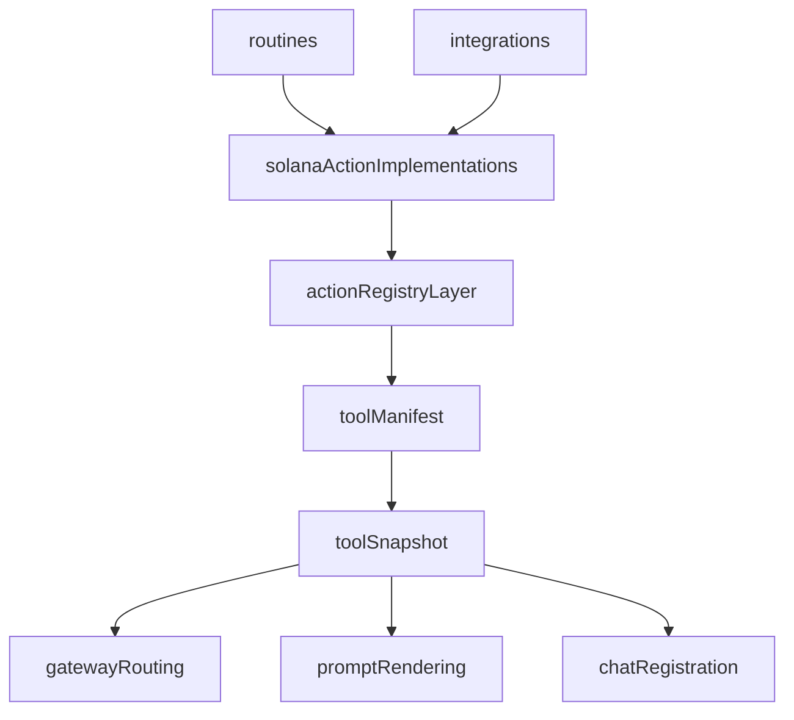

# Stabilize Tools And Action Cleanup

## Current State

- The canonical runtime tool layer is already under [apps/trenchclaw/src/runtime/tools](apps/trenchclaw/src/runtime/tools).
- [apps/trenchclaw/src/actions/registry.ts](apps/trenchclaw/src/actions/registry.ts) is now the catalog and manifest-input layer for runtime actions and workspace tools.
- [apps/trenchclaw/src/solana/actions](apps/trenchclaw/src/solana/actions) still contains most concrete action implementations.
- The migration is partially landed, but stale naming and stale references still exist across runtime types, tests, knowledge docs, release notes, and the current plan.
- The safest path is to stabilize what already exists instead of introducing another new root or another big tree move.

## Main Goals

- Finish the `tools` migration cleanly.
- Remove outdated references to deleted or superseded structures.
- Reduce duplicate glue code in tool metadata, routing, prompt grouping, and registry wiring.
- Keep behavior stable while the app is still in a partially migrated state.

## Target Architecture

## Phase 1: Stabilize The Runtime Tools Layer

- Treat [apps/trenchclaw/src/runtime/tools/types.ts](apps/trenchclaw/src/runtime/tools/types.ts), [apps/trenchclaw/src/runtime/tools/snapshot.ts](apps/trenchclaw/src/runtime/tools/snapshot.ts), [apps/trenchclaw/src/ai/gateway/lane-policy.ts](apps/trenchclaw/src/ai/gateway/lane-policy.ts), and [apps/trenchclaw/src/runtime/prompt/tool-menu.ts](apps/trenchclaw/src/runtime/prompt/tool-menu.ts) as the canonical runtime flow.
- Keep `runtime/tools` as the only runtime tool source of truth.
- Normalize public naming toward `Tool*` terminology in runtime-facing APIs and docs.
- Keep [apps/trenchclaw/src/runtime/chat/service.ts](apps/trenchclaw/src/runtime/chat/service.ts) and [apps/trenchclaw/src/runtime/workspace-bash.ts](apps/trenchclaw/src/runtime/workspace-bash.ts) as consumers of tool metadata, not parallel metadata owners.

## Phase 2: Audit And Remove Outdated Code

- Do a focused stale-reference audit across code, tests, docs, knowledge, and release notes.
- Prioritize real outdated references that actively confuse the codebase:
  - stale `runtime/capabilities` references in knowledge and docs
  - stale runtime naming in code, tests, and docs
  - tests whose names or fixtures still describe the old structure
  - release and plan text that still describes deleted files or superseded paths
- Distinguish cleanup classes:
  - code-breaking stale references
  - test-only stale references
  - docs-only stale references

## Phase 3: Simplify The Registry Without Re-architecting

- Use [apps/trenchclaw/src/actions/registry.ts](apps/trenchclaw/src/actions/registry.ts) as the current manifest source because that is where action and workspace tool definitions now live.
- Do not redesign the registry format again.
- Only split `registry.ts` if the split reduces code and keeps imports stable.
- Safe extractions:
  - `actions/registry/runtime-actions.ts`
  - `actions/registry/workspace-tools.ts`
  - `actions/registry/release-readiness.ts`
- Keep `actions/registry.ts` as the stable barrel so the rest of the app does not churn.

## Phase 4: Lock The Action Boundaries

- Clarify the current intended layering before any more moves:
  - [apps/trenchclaw/src/actions](apps/trenchclaw/src/actions) is the registry and model-facing action catalog layer.
  - [apps/trenchclaw/src/solana/actions](apps/trenchclaw/src/solana/actions) remains the concrete implementation tree.
- If this separation still works after cleanup, stop there.
- Avoid broad moves between `src/actions` and `src/solana/actions` unless there is a clear reduction in code, not just a prettier tree.

## Phase 5: Small In-Place Cleanup In `solana/actions`

- Keep implementation code rooted at [apps/trenchclaw/src/solana/actions](apps/trenchclaw/src/solana/actions).
- Prefer small cleanup phases only:
  - fix misleading or incomplete barrels
  - resolve orphan or half-wired modules
  - remove obviously dead stubs
  - split only the heaviest clusters into `schema.ts`, `service.ts`, `action.ts`, and `index.ts` where this clearly reduces file size and duplicate logic
- Candidate cleanup targets:
  - swap and trigger order family
  - runtime memory, queue, and knowledge family
  - managed wallet contents family
  - API wrappers with separate `*-actions.ts` and helper modules where the layering is unclear

## Phase 6: Update Docs, Knowledge, And Public Surfaces

- Rebase stale docs and knowledge only after code is stable.
- Priority files:
  - [apps/trenchclaw/src/ai/brain/knowledge/runtime-reference.md](apps/trenchclaw/src/ai/brain/knowledge/runtime-reference.md)
  - [apps/trenchclaw/src/ai/brain/knowledge/deep-knowledge/trenchclaw-jupiter-integration.md](apps/trenchclaw/src/ai/brain/knowledge/deep-knowledge/trenchclaw-jupiter-integration.md)
  - [apps/trenchclaw/src/lib/knowledge/knowledge-index.ts](apps/trenchclaw/src/lib/knowledge/knowledge-index.ts)
  - release notes and architecture/docs that still describe the old naming
- Include broader repo fallout in the cleanup plan:
  - runner imports and startup messaging
  - runtime surface naming drift
  - storage and contract naming drift where it directly affects this migration

## Verification

- Use the existing runtime behavior tests as the main lock throughout:
  - [tests/runtime/toolSnapshot.test.ts](tests/runtime/toolSnapshot.test.ts)
  - [tests/runtime/chat-service.test.ts](tests/runtime/chat-service.test.ts)
  - [tests/runtime/rssNewsToolSnapshot.test.ts](tests/runtime/rssNewsToolSnapshot.test.ts)
  - [tests/runtime/trackerToolSnapshot.test.ts](tests/runtime/trackerToolSnapshot.test.ts)
  - [tests/runtime/workspace-bash.test.ts](tests/runtime/workspace-bash.test.ts)
  - [tests/runtime/workspace-cli-tools-suite.test.ts](tests/runtime/workspace-cli-tools-suite.test.ts)
- Add broader migration coverage where relevant:
  - install and bootstrap tests
  - runner and runtime integration smoke tests
  - storage and runtime tests if import churn touches those paths
- Treat unrelated pre-existing type errors outside the migration path as separate cleanup unless they block the touched modules directly.

## What To Avoid

- Do not create another new root or another abstraction layer.
- Do not do a full implementation move while the current partial migration is still settling.
- Do not rename everything at once.
- Do not split small stable files for style only.
- Do not let docs drive structure changes before the runtime code is stable.

## Rollout Order

1. Stabilize `runtime/tools` public names, imports, and tests.
2. Remove stale code, test, and doc references so the current tree tells one consistent story.
3. Shrink and split `actions/registry.ts` only if that reduces code without increasing churn.
4. Lock the role of `src/actions` vs `src/solana/actions` and avoid more broad moves unless clearly necessary.
5. Do small in-place cleanup in `src/solana/actions` only where it lowers complexity.
6. Update docs, knowledge, release notes, and broader repo references last.

