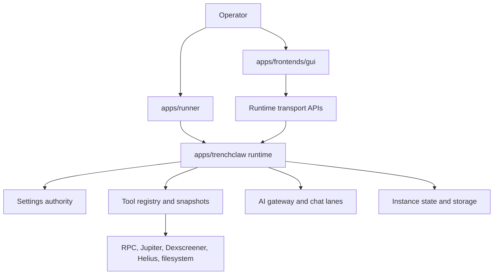

# TrenchClaw Architecture

TrenchClaw is a local Solana runtime with a GUI on top of it.

The runtime owns settings, state, tools, policy, storage, chat orchestration, and execution. The GUI talks to that runtime. The runner packages and launches it.

## System Shape

## Product Model

### `apps/trenchclaw`

This is the authority.

It owns:

- runtime boot and service startup
- settings loading and protected settings authority
- tool registration, tool snapshots, and model-facing metadata
- execution policy, confirmations, throttles, and write boundaries
- instance storage, logs, caches, memory, and queue state
- chat orchestration and lane-specific prompt assembly

### `apps/frontends/gui`

This is the local web client.

It renders runtime state and sends commands through transport APIs. It does not become the source of truth for state on disk.

### `apps/runner`

This is the packaged launcher.

In release installs it starts the runtime and serves the GUI together.

## Boot And Authority

The runtime boots in `apps/trenchclaw/src/runtime/bootstrap.ts`.

At a high level it:

1. resolves the app root and mutable runtime state root
2. resolves the active instance
3. materializes the instance layout from shipped seed files
4. loads runtime settings and enforces protected settings authority
5. initializes storage, logs, runtime services, and transport
6. builds the current runtime tool snapshot
7. registers the enabled runtime action catalog and policy engine
8. starts chat, scheduler, and supporting services

The important point is that TrenchClaw does not boot into a generic shared workspace. It boots around one active instance, and that instance scopes the runtime state, workspace surface, and operator context.

## Settings Authority

TrenchClaw treats settings as a runtime contract, not loose prompt text.

The runtime loads instance settings, applies profile-aware agent overlays where allowed, and keeps user-protected paths authoritative for sensitive areas such as:

- trading configuration
- RPC selection
- dangerous wallet behavior
- confirmation policy

That keeps the GUI, runtime, and agent on one consistent settings model.

## Tool Platform

The tool system lives under `apps/trenchclaw/src/tools`.

The main pieces are:

- `registry.ts`
  - defines the static catalog of runtime actions and workspace tools
  - attaches descriptions, routing hints, example input, settings gates, and release-readiness metadata
- `snapshot.ts`
  - computes the current `RuntimeToolSnapshot`
  - applies settings, filesystem policy, visibility, and provider-specific readiness checks
- `types.ts`
  - defines the tool-facing types shared by the runtime, gateway, chat service, and transport APIs
- `core/`, `knowledge/`, `market/`, `trading/`, `wallet/`, `workspace/`
  - contain the concrete tool implementations

The separation is deliberate:

- the registry says what the runtime knows how to do
- the snapshot says what is available right now
- the gateway decides what each chat lane should receive
- the chat service binds only that selected subset to the model

## Runtime Tool Snapshot

The snapshot has three useful views:

- `actions`
  - the runtime action catalog that passed inclusion and settings checks
- `workspaceTools`
  - the workspace tool surface the runtime can describe through transport APIs
- `modelTools`
  - the tools that are actually eligible for LLM binding on the current boot

That last view is intentionally narrower than the raw catalog. A tool can exist in the registry and still not be model-visible for the current instance, policy, or provider setup.

## Chat Lanes

TrenchClaw does not expose one flat tool bag to every model interaction.

It has distinct chat lanes with different prompts and tool visibility:

- `operator-chat`
  - the main operator conversation
  - gets the operator prompt, live runtime context, wallet summary, and a routed subset of model tools
- `workspace-agent`
  - gets the workspace prompt surface and tools marked for workspace-agent use
- `background-summary`
  - gets the summary prompt surface and only tools explicitly visible to that lane

In practice this means the operator lane stays flexible, but still remains narrower than "everything in the repo."

## Chat And Model Exposure

The model-facing flow is:

1. `src/tools/registry.ts` defines the catalog
2. `src/tools/snapshot.ts` builds the current runtime snapshot
3. `src/ai/gateway/lanePolicy.ts` selects tool names for the current lane
4. `src/ai/gateway/operatorPrompt.ts` renders the operator prompt around that tool subset
5. `src/runtime/chat/service.ts` registers only those tools with AI SDK `tool(...)`

For `operator-chat`, the gateway does not just dump every visible tool into the turn. It keeps a small always-on set, routes additional tool groups from the latest user message, and preserves workspace or knowledge escape hatches only when they are enabled by policy.

That keeps the machine-call contract explicit:

- if a tool is not in the current snapshot, it is not available
- if a tool is not selected for the lane, it is not registered for that turn
- if a tool has a schema, description, examples, or confirmation rule, that metadata comes from the runtime tool layer rather than scattered prompt text

## Execution Boundaries

TrenchClaw is a constrained execution runtime, not a thin LLM shell.

The main guard rails are:

- tool-gated execution
  - the model only sees tools that exist in the current runtime snapshot
- settings-aware policy checks
  - unsupported or disabled actions are blocked before execution
- explicit confirmation for dangerous actions
  - some actions require a user confirmation token when dangerous-mode confirmations are enabled
- protected settings authority
  - user-protected settings win over agent overlays on sensitive paths
- write-scope boundaries
  - runtime writes stay inside allowed roots instead of arbitrary host paths
- instance-scoped workspace tools
  - workspace reads and writes are tied to the active instance
- runtime action throttles
  - trading-oriented execution is rate-limited through runtime policy rather than left to prompt discipline

This is one of the main differences between TrenchClaw and thinner shell-first agent wrappers.

## `.runtime` vs `.runtime-state`

This is the distinction most users and contributors need to understand.

### `.runtime`

`.runtime` is the repo-tracked contract and seed area.

It holds the shipped structure and default instance templates the runtime uses to materialize new instance layouts. It is not the live mutable source of truth.

### `.runtime-state`

`.runtime-state` is the mutable runtime root.

That is where TrenchClaw writes per-instance runtime data such as:

- the active instance pointer
- instance profile metadata
- secrets and vault data
- AI, compatibility, trading, and wakeup settings
- SQLite state and queue state
- logs, caches, and memory artifacts
- managed wallet files and indexes
- the instance workspace and registry files

In workspace development, the default mutable root is `~/.trenchclaw-dev-runtime`. In packaged installs the default is `~/.trenchclaw`. You can override either with `TRENCHCLAW_RUNTIME_STATE_ROOT`.

## Instance Layout

Each instance lives under `.runtime-state/instances/<id>/`.

Important paths include:

- `instance.json`
  - instance identity and profile metadata
- `settings/ai.json`
  - AI provider and model selection
- `settings/settings.json`
  - runtime compatibility and general settings
- `settings/trading.json`
  - trading configuration for that instance
- `settings/wakeup.json`
  - wakeup behavior and related controls
- `secrets/vault.json`
  - secret material and provider credentials
- `data/runtime.db`
  - main SQLite runtime store
- `cache/queue.sqlite`
  - queue and related runtime cache data
- `cache/generated/`
  - generated runtime support artifacts used for prompt/context assembly
- `logs/live/`, `logs/sessions/`, `logs/summaries/`, `logs/system/`
  - live, per-session, summary, and system log streams
- `keypairs/`
  - managed wallets and wallet sidecars
- `workspace/`
  - the instance-scoped operator workspace
- `workspace/configs/news-feeds.json`
  - instance-scoped news feed registry
- `workspace/configs/tracker.json`
  - instance-scoped tracked wallet and token registry
- `workspace/added-knowledge/`
  - instance-scoped operator-added knowledge
- `shell-home/`, `tmp/`, `tool-bin/`
  - runtime shell support directories

Instances use ids like `01`, `02`, and `03`, and the display name comes from `instance.json`.

The runtime seeds this layout from `.runtime`, and for structured files such as tracker and news-feed registries it merges new shipped defaults without wiping the operator's existing entries.

## Why The Instance Model Matters

The instance boundary is one of the main TrenchClaw guard rails.

It means:

- one operator profile does not silently bleed into another
- settings, vaults, wallets, logs, and workspace state stay grouped together
- tracker and feed registries stay local to the active instance
- the runtime can enforce instance-scoped storage and workspace rules
- the GUI can switch instances without becoming the storage authority

## Short Mental Model

If you want the shortest correct model, use this:

- `apps/trenchclaw` is the authority
- `apps/frontends/gui` is the client
- `apps/runner` packages and launches the runtime
- `.runtime` is the shipped contract
- `.runtime-state` is the live mutable state
- the active instance is the boundary that scopes state, tools, and operator workflows
