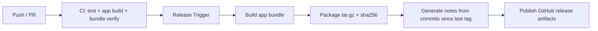
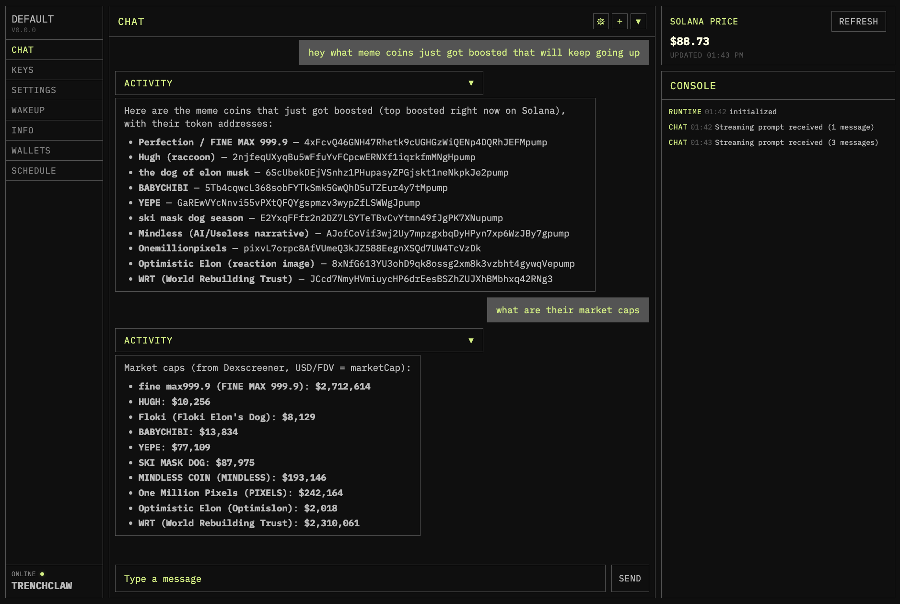

<p align="center">
  
</p>

<p align="center">
  <a href="./package.json"></a>
  <a href="https://bun.sh"></a>
  <a href="https://ai-sdk.dev/"></a>
  <a href="https://x.com/mert"></a>
  <a href="https://phantom.app/"></a>
  <a href="https://anza.xyz/"></a>
  <a href="https://github.com/anza-xyz/kit"></a>
  <a href="https://www.metaplex.com"></a>
  <a href="https://www.jup.ag"></a>
  <a href="https://www.helius.dev"></a>
  <a href="https://solana.com"></a>
  <a href="https://streamdown.ai/"></a>
  <a href="https://www.meteora.ag/"></a>
  <a href="https://ai-sdk.dev/tools-registry/bash-tool"></a>
  <a href="https://svelte.dev/"></a>
  <a href="https://bun.sh/docs/api/sqlite"></a>
</p>

## 長年の Solami 開発者が作った gud tek

このプロジェクトの完成を見たいと思っていただけたら、ぜひスターを付けてください。関心の度合いを測る助けになります。ありがとうございます。長年の Solami 開発者が作る gud tek です。

# TrenchClaw

TrenchClaw は、Solana ブロックチェーン向けの openclaw 風エージェント型 AI ランタイムです。モジュール式のオンチェーンアクションを実行し、自動売買ルーチンを走らせ、軽量な Svelte GUI からオペレーターに完全な可視性と制御を提供する、個人用 Solana アシスタントです。非常に危険であり、セキュリティが十分に整うまでにはまだ時間がかかります。

[`@solana/kit`](https://github.com/anza-xyz/kit) と [`Bun`](https://bun.sh) を土台から使って構築しており、1.0 では GUI / モバイル向けの操作面も予定しています。レガシー依存はゼロ（旧 `@solana/web3.js` v1 も不使用）。機能的、合成可能、ツリーシェイク可能。自分のバイナリに何が入るかを気にするオペレーター向けに設計しています。

現在のリリースで主に必要なキーは次のとおりです。Helius ベースの読み取り用 Helius API キー、スワップ用 Jupiter Ultra キー、チャット駆動ワークフロー用 OpenRouter または Gateway API キーです。

完全なアーキテクチャ: [`ARCHITECTURE.md`](./ARCHITECTURE.md)

## v0.1.0 機能チェックリスト

- [x] OpenRouter または Vercel AI Gateway による AI チャット
- [x] ローカルインスタンスのサインイン、Vault、取引設定
- [x] 管理対象ウォレットの残高・保有資産読み取り
- [x] ウォレット作成、グループ化、リネーム
- [x] Helius で拡張された読み取りとスワップ履歴
- [x] Dexscreener による市場・トークン調査
- [x] Jupiter Ultra スワップ
- [x] Jupiter Trigger API フロー
- [x] キュージョブ、予約 Ultra スワップ、アクションシーケンス
- [x] 直接送金とトークンアカウント整理
- [x] ランタイムメモリ、キュー、会話履歴
- [x] チャット、ウォレット、キー、設定、アクティビティ、ランタイム状態向けデスクトップ GUI
- [ ] ウォレット作成・リネーム専用 GUI フロー
- [ ] GUI 内の完全なランタイム設定エディタ
- [ ] スケジュールと自動化 UX の改善
- [ ] Jupiter Ultra 以外の標準スワップパス
- [ ] Telegram チャットコネクタ
- [ ] gatekeeper 設定オプションの追加
- [ ] 定期エージェントループ

クイックリンク:

- [Quickstart](https://trenchclaw.vercel.app/docs)
- [Capability Matrix](https://trenchclaw.vercel.app/docs/beta-capability-matrix)
- [Runtime Architecture and Boundaries](#runtime-architecture-and-boundaries)
- [Why TypeScript?](#why-typescript)
- [Why Solana Kit](#why-solana-kit)
- [TrenchClaw vs ElizaOS and Agent Kit](#trenchclaw-vs-elizaos-and-agent-kit)

スポンサーを募集しています。ぜひご支援ください: 7McYcR43aYiDttnY5vDw3SR6DpUxHG8GvLzhUsYFJSyA

### これは非常に危険です。使用すると高い確率で予期しないことが起こります

---

## [始める](https://trenchclaw.vercel.app/docs)

インストールと初回起動はドキュメントを使ってください。

- [Getting Started](https://trenchclaw.vercel.app/docs/getting-started)

## ビルド + リリース（現在の手順）

公開リリースは、スタンドアロンでコンパイルされた `trenchclaw` バイナリとして配布されます。Bun はローカル開発とリリースエンジニアリングには必要ですが、エンドユーザーのインストールには不要です。

```bash
# ローカル検証
bun run release:build -- --version v0.0.0 --run-checks

# 手動リリースで下書き本文を使う場合
# releases/0.0.0.md
```

リリース公開は GitHub Actions の `Release` ワークフロー（`workflow_dispatch`）から行います。

- `release_mode=manual` は現在コミット済みのバージョンを公開します
- `release_mode=patch` は次のパッチバージョンへ自動で上げ、GitHub 生成のノートを使用します
- `release_mode=minor` は次のマイナーバージョンへ自動で上げ、GitHub 生成のノートを使用します
- `release_notes_mode=auto` は `manual` リリースでも GitHub 生成ノートを使います
- `release_notes_mode=draft` は必要なときに `releases/<version>.md` を使います



## ダッシュボード UI



---

## Runtime Architecture and Boundaries

TrenchClaw は、自由形式のチャットボットではなく、制約付き実行システムとして設計されています。アーキテクチャは、コントロールプレーンの推論とエグゼキューションプレーンの副作用を分離し、その後で副作用を伴う操作に対してポリシーとファイルシステム制約を適用します。

### 1) エージェントのコントロールプレーン（型付きオーケストレーション）

- ランタイムコア（`apps/trenchclaw/src/ai/core`）は `ActionRegistry`、`ActionDispatcher`、`PolicyEngine`、`Scheduler`、型付きイベントバスを組み合わせます。
- ブートストラップ配線（`apps/trenchclaw/src/runtime/bootstrap.ts`）は、正規化された設定からランタイムを構築し、許可されたアクションだけを登録し、アクションコンテキストにアダプターを注入します。
- アクション契約は型付き（`Action<Input, Output>`）で、実行前にスキーマ検証されます。
- イベント送出は構造化されており（`action:*`、`policy:block`、`queue:*`、`rpc:failover`）、追跡可能性のために SQLite / ファイル / セッションログへ永続化されます。

### 2) エグゼキューションプレーン（オンチェーンアクション + オフチェーンヘルパー）

- オンチェーン実行可能なアクションは `apps/trenchclaw/src/solana/actions/wallet-based/*` 配下にあります（ウォレット操作、送金、スワップ、そしてまだ大きく打ち出していないプライバシー系フローの一部）。
- オフチェーンのヘルパーアクションは `apps/trenchclaw/src/solana/actions/data-fetch/*` 配下の明示的なモジュールです。
  - RPC 読み取り（`getAccountInfo`、`getBalance`、`getMultipleAccounts` など）
  - トークン / メタデータ / 価格 / 市場データ
  - Helius による拡張読み取り
  - Dexscreener リサーチ
- 外部システムとの境界はアダプター化されているため、RPC プロバイダーやデータソースを差し替えてもアクションコード本体を書き換えずに済みます。

### 3) ポリシー + ファイルシステム境界

- ポリシーエンジンは、アクションタイプ、金額しきい値、許可リスト、確認要件などに基づいてアクションを許可・拒否・保留します。
- 実行前に危険な操作を抑えるため、ローカル制約と明示的なガードレールを適用します。
- ランタイムは追跡しやすいように決定理由を保存します。

### 4) 可観測性 + 状態

- セッション、ジョブ、ポリシー判断、チャット履歴、実行イベントはローカルに保存され、再起動後も復元できます。
- 構造化イベントにより、オペレーターは「何が起きたか」だけでなく「なぜそうなったか」も確認できます。

### 5) なぜこの境界が重要なのか

自由形式エージェントをそのまま資金や署名権限に接続するのは、事故の起きやすい設計です。TrenchClaw は推論層と実行層を明確に分け、すべての重要操作を型・スキーマ・ポリシーの三段階で縛ることで、危険な曖昧さを減らします。

---

## Why TypeScript?

エージェントランタイムは、実際には「ツール契約」「ストリーム」「構造化イベント」「JSON ペイロード」を扱うシステムです。この種のシステムでは、以下が最重要になります。

1. **ランタイム検証可能な厳密なツール契約** — 実行前に LLM の引数を必ず検証する必要があります（ガードレール）。実際には「どこでも JSON Schema」+ ローカルバリデーターになります。
2. **第一級のイベントストリーム** — 最終テキストだけでは足りません。部分トークン、ツール呼び出し意図、ツール引数、ツール結果、リトライ、エラー、トレースなどの構造化イベントが必要です。
3. **合成可能なミドルウェア** — ロギング、秘匿化、ポリシーチェック、レート制限、キャッシュ、リトライ、サーキットブレーカー、ツールルーティング。
4. **高速な反復** — エージェント品質は、スキーマ調整、ツール UX、プロンプト / ツール説明、トレース分析をどれだけ速く回せるかに大きく左右されます。

こうした要件は、スキーマを第一級アーティファクトとして扱い、JSON を自然な受け渡し形式とし、ストリーミングを第一級 API とし、Web デプロイを標準とするエコシステムを強く選びます。

**コンパイル時の型 + ランタイムスキーマ（システム言語で欠けがちな半分）。**

エージェントでは、型だけでは不十分です。LLM に契約を見せる必要があり、ランタイム側でも信頼できないツール引数を検証しなければなりません。Vercel AI SDK のツールモデルでは、ツールは `inputSchema`（Zod または JSON Schema）を宣言します。これはモデル側のツール選択・引数整形に使われるだけでなく、`execute` 実行前にランタイム検証にも使われます。TypeScript はここで非常に強いです。

- Zod は TypeScript で書きやすい
- スキーマから TS 型を推論できる（またはその逆）ため、スキーマと実装が乖離しにくい
- スキーマオブジェクトをコード生成なしでルーティング層へそのまま渡せる

多くのシステム言語スタックでは、「優れた静的型はあるがモデルに見せるスキーマは手書き / 重複」「ランタイム検証には重いコード生成パイプラインが必要」のどちらかになりがちです。**エージェントコードは接着剤のコードです。接着剤コードでは重いコード生成が足かせになります。**

**Vercel AI SDK は設計上 TypeScript ファーストです。**

Vercel は AI SDK を “The AI Toolkit for TypeScript” と位置づけています。ツール呼び出し（`generateText` + `tool(...)`）は中心的なプリミティブです。AI SDK の strict mode の振る舞い（ツールスキーマ互換性、fail-fast の意味論）は、上級エージェントを本番運用する上でまさに必要な細部です。もしオーケストレーションが Vercel AI SDK のプリミティブ—ツール、ストリーム、UI ストリーミング、プロバイダーアダプター—を中心にしているなら、最も摩擦が少ない母語は TS です。

**構造的型付け + JSON ネイティブなペイロード + 扱いやすい変換。**

エージェントのペイロードは、ツール引数、ツール結果、中間計画、トレースなど、構造で表されるオブジェクトです。TS は JSON 形状と構造的型付けがよく噛み合い、変換パイプラインも簡潔（`map` / `filter` / `reduce`、Zod transforms）で、イベントストリームを判別可能共用体として表現して `switch` を網羅的に書けます。これはエージェントトレースで非常に大きな利点です。システム言語では、強い型の構造体と動的 JSON の橋渡しに、シリアライズの定型処理やバージョニングの摩擦が増えがちです。

**JS / TS のエージェントエコシステムは、デフォルトでスキーマ駆動です。**

コミュニティの実践は「スキーマを第一級の値として扱う」方向に収束しており、多くの統合も Node / TS ツールチェーンを前提にしています。LangChain を使わなくても、スキーマ指向の統合をポートではなく、そのまま活用しやすいという意味があります。

### なぜシステム言語はここで不利になりやすいのか

これは純粋な性能の話ではなく、「複雑さがどこに発生するか」の問題です。

- **エージェントオーケストレーションは CPU バウンドではなく、I/O バウンドで統合中心です。** 多くのエージェントループは、モデル呼び出し、Web API 呼び出し、DB 待ち、UI へのイベントストリーム送信、ツール呼び出しの検証とルーティングに時間を使います。この特性は Rust / Zig / C++ の強みを最大化しません。
- **難しいのは実行速度ではなく契約の進化です。** 主要な失敗要因は、スキーマのズレ、ツールの曖昧さ、不完全 / 不正な引数、ツール署名を安全に進化させられないことです。TS + スキーマファーストのパターンは、スキーマオブジェクトをコードの近くに置き、そのままシステム全体でデータとして流せるため、ズレを減らします。システム言語では「データとしての契約」が、ビルド時アーティファクト（コード生成）、別ファイルのスキーマ、あるいは TS + Zod ほど扱いやすくないランタイムリフレクションになりやすく、反復コストが上がります。
- **ストリーミング UX は JS ランタイムモデルの方が作りやすいです。** トークンストリーミング、部分的な構造化出力、ツール呼び出し可視化、リアクティブな UI 更新など、Vercel / Next のエコシステムはこのワークフローに最適化されており、AI SDK は UI と同じ言語・同じランタイムでそのプリミティブを提供します。

### なぜ多くの Go / Rust エージェントスタックは、この環境に合いにくいのか

このリポジトリの環境（AI SDK オーケストレーション + スキーマファーストのツール + Solana 実行）では、主なリスクは通常、生の計算性能不足ではなく、危険または曖昧なツール挙動です。

- **AI SDK + Zod は TS 内で単一のコントロールプレーンになります。** 同じスキーマオブジェクトが、モデルに見えるツール契約とランタイム検証の両方を駆動します。Go / Rust では、これが生成型、JSON Schema、アダプター層に分かれやすく、不一致リスクが高まります。
- **ガードレールの高速反復は、コンパイルターゲットより重要です。** このリポジトリでは、ツール説明、ポリシーチェック、確認ゲート、スキーマ制約を頻繁に調整します。TS なら変更点を一か所にまとめてすばやく出せ、再生成や再バインドのサイクルを減らせます。
- **ウォレットと実行の安全性は、ランタイムポリシーの問題です。** 確認要件、金額 / 想定元本制限、許可リスト、冪等性キー、判断トレース、ポリシーブロック理由は、すべてオーケストレーション / ランタイム層にあります。その層は TS ネイティブなスキーマとイベントツールの恩恵を最も受けます。
- **多くの Go / Rust “エージェントフレームワーク” は、オペレーター安全 UX よりインフラ形状を最適化しがちです。** サービス性能では非常に優秀でも、厳密なツールスキーマ、豊富なストリームイベント、取引 / オペレーター系システムに求められる対話的安全制御まで揃えるには、追加のカスタム実装が必要になりやすいです。

システム言語は、厳密な境界の背後（署名、パース、決定論的実行、高スループットサービス）では依然として非常に適しています。ただし、Vercel AI SDK のツール契約やストリーミング UI 挙動と密結合のオーケストレーターにとって、最短ルートであることはあまり多くありません。

### 実践的な折衷案

このスタックに最も強いデフォルト構成は次のとおりです。

> **TypeScript オーケストレーター（エージェントの頭脳） + 必要な場合のみシステム言語の実行器（筋肉）**

- **TS が担うもの:** ツールスキーマと検証、オーケストレーションループとルーティング、ストリームイベントと UI 統合、トレースの永続化形式 / バージョニング、プロバイダーアダプター（AI SDK）
- **Rust / Zig / Go が担うもの（任意）:** 暗号処理や低レイテンシが重要なプリミティブ（署名、パース）、サンドボックス化されたツール実行ファイル、決定論的計算カーネル、厳密なスキーマ越しの RPC サービス

これにより、エージェント的な流れ（高速反復、スキーマファーストのツール、Vercel AI SDK 統合）を維持しながら、システム言語は本当に優位な箇所にのみ使えます。もしスループット、レイテンシ、ネイティブ制約のいずれもボトルネックでないなら、オール TypeScript 実装が通常はより単純で、より良いデフォルトです。

### なぜ Solana Kit がこのアーキテクチャで有利なのか

`@solana/kit` は単なる Solana SDK の選択ではなく、この TypeScript スタックが重視するエージェント特性も強化します。

- **スキーマに沿ったツール境界:** Kit の型付き RPC、トランザクション、署名 API は、JSON Schema / Zod ベースのツール契約ときれいに対応します。
- **より安全なオーケストレーションループ:** 関数的で不変なトランザクション合成により、複数ステップのツールパイプライン内で隠れた可変バグを減らせます。
- **ドリフトリスクの低減:** アカウント、署名者、blockhash の寿命、lamports（`bigint`）に関する厳密な TS 型が、モデル選択されたツール引数を実行可能な現実により近づけます。
- **反復速度の向上:** 合成可能なモジュラー import と生成クライアント（Codama）により、Solana アクションを追加・改良するときに配線を作り直さずに済みます。

### いつ TypeScript が実質的に必須になるのか

以下がすべて当てはまる場合、TS は事実上必須です。

1. オーケストレーションが Vercel AI SDK のプリミティブ（ツール、ストリーム、strict mode の挙動）を中心にしている。
2. ツール契約が急速に進化し、モデルに見えるスキーマ、ランタイム検証、実装型を常に一致させる必要がある。
3. プロダクトが Next / Vercel 風の配置面で、ストリーミングファーストの UX に依存している。

この条件下では、システム言語のオーケストレーターは TS ネイティブなスキーマ + ストリーミング + UI 統合層をゼロから再構築しがちです。

---

## Why Solana Kit

TrenchClaw は [`@solana/web3.js`](https://www.npmjs.com/package/@solana/web3.js) v1 を使いません。代わりに [`@solana/kit`](https://github.com/anza-xyz/kit)（旧 web3.js v2）を使用しています。これは [Anza](https://anza.xyz) による公式の全面書き直しです。

旧 `@solana/web3.js` は、モノリシックでクラスベースの SDK です。`Connection` クラスにすべての RPC メソッドが一つのツリーシェイク不可能なオブジェクトとして詰め込まれています。1 メソッドしか呼ばなくても 50 メソッド呼んでも、ユーザーはライブラリ全体をダウンロードすることになります。サードパーティ製の暗号ポリフィルに依存し、`bigint` を使うべきところで `number` を使い、緩い TypeScript 型のせいでバグがランタイムまで滑り込みます。

Kit はその逆です。関数的で、合成可能で、依存ゼロ、完全にツリーシェイク可能です。Ed25519 署名にはユーザースペースのポリフィルではなく、ネイティブの [Web Crypto API](https://developer.mozilla.org/en-US/docs/Web/API/Web_Crypto_API) を使用します。lamport 値には `bigint` を使います。欠けた blockhash、欠けた signer、誤った account 型を、トランザクションがオンチェーンで失敗した後ではなく、コンパイル時に捕まえます。

### 数字で見る違い

| | `@solana/web3.js` v1 | `@solana/kit` v6 |
|---|---|---|
| アーキテクチャ | モノリシックな `Connection` クラス | 28 個のモジュラーパッケージ |
| バンドル（minify 後） | 約 450 KB | 約 100 KB 圧縮 |
| ツリーシェイク | 不可 | 可能 |
| 依存関係 | 複数（bn.js、borsh、buffer など） | ゼロ |
| 暗号 | ユーザースペースのポリフィル | ネイティブ Web Crypto API（Ed25519） |
| 大きな数 | `number`（2^53 超で精度喪失） | `bigint`（lamports でも安全） |
| 型安全性 | 緩い | 厳密（コンパイル時の signer / blockhash / account 検査） |
| 確認レイテンシ | ベースライン | 実運用テストで約 200ms 高速 |
| メンテナンス | セキュリティパッチ中心 | Anza による活発な開発 |

実際の影響として、[Solana Explorer](https://explorer.solana.com) のホームページは Kit へ移行後、バンドルサイズが 311 KB から 226 KB に落ちました（**26% 削減**）。

### 実際に何が変わるのか

**`Connection` クラスはもう不要です。** Kit はこれを `createSolanaRpc()` と `createSolanaRpcSubscriptions()` に置き換えます。これらは、実際に呼び出すメソッドだけを束ねる軽量プロキシオブジェクトです。RPC が 1 メソッド対応でも 100 メソッド対応でも、バンドルサイズは同じままです。

**`Keypair` も不要です。** Kit は `generateKeyPairSigner()` を通じて、Web Crypto API の `CryptoKeyPair` を使います。秘密鍵を JavaScript 環境へ露出させる必要はありません。署名は `TransactionSigner` オブジェクトを通じて行われ、ハードウェアウォレット、ブラウザ拡張、CryptoKey、テスト用 noop signer などの実装差を抽象化します。

**可変トランザクションも不要です。** Kit は、トランザクションメッセージを組み立てるために関数型の `pipe()` パターンを使います。各ステップは更新済み TypeScript 型を持つ新しい不変オブジェクトを返すため、コンパイラはトランザクションが何を持ち（手数料支払者、blockhash、命令、署名者）、何を欠いているかを、ネットワークへ送る前に追跡できます。

```typescript
import { pipe, createTransactionMessage, setTransactionMessageFeePayerSigner,
  setTransactionMessageLifetimeUsingBlockhash, appendTransactionMessageInstructions,
  signTransactionMessageWithSigners } from '@solana/kit';

const tx = pipe(
  createTransactionMessage({ version: 0 }),
  (tx) => setTransactionMessageFeePayerSigner(payer, tx),
  (tx) => setTransactionMessageLifetimeUsingBlockhash(blockhash, tx),
  (tx) => appendTransactionMessageInstructions([transferInstruction], tx),
);

const signed = await signTransactionMessageWithSigners(tx);
```

**手書きの命令ビルダーも不要です。** プログラムとのやり取りには、[Codama](https://github.com/codama-idl/codama) の IDL ファイルから生成したクライアントを使います。`lib/client/idl/` に IDL JSON を置いてコード生成を走らせれば、型付き命令ビルダー、アカウントデコーダー、PDA ヘルパー、エラー enum が得られます。TrenchClaw はこうした生成クライアントから import し、命令を手作業で組み立てません。

---

## TrenchClaw vs ElizaOS and Agent Kit

現在 Solana エージェントスタックを評価しているなら、実務上の分かれ目はこうです。TrenchClaw は `@solana/kit` に直接構築されている一方で、既存の多くのエージェントエコシステムは依然として旧 `@solana/web3.js` ベースの統合に依存しています。

| | TrenchClaw | ElizaOS（一般的な Solana プラグイン構成） | Agent Kit 系スタータースタック |
|---|---|---|---|
| 主な Solana SDK | `@solana/kit` | `@solana/web3.js` ベースのプラグイン / アダプターが一般的 | `@solana/web3.js` ラッパーが一般的 |
| API スタイル | 関数型 + 合成可能 | フレームワーク / プラグイン駆動 | フレームワーク / ツールキット駆動 |
| ツリーシェイク | 強い（モジュラーな Kit パッケージ） | `Connection` 型クライアントのため弱くなりがち | 幅広いユーティリティ束のため弱くなりがち |
| tx 合成における型保証 | Kit パイプラインで強いコンパイル時検査 | プラグイン品質に依存 | ツールキット層に依存 |
| ランタイム重心 | 端末優先のオペレーターランタイム | マルチプラットフォームエージェントフレームワーク | 汎用 AI エージェント開発 UX |

### クロスフレームワーク文脈（同じベンチマークソース）

| Framework/runtime | Throughput (req/s) |
|---|---:|
| Rust + Axum | 21,030 |
| Bun + Fastify | 20,683 |
| ASP.NET Core | 14,707 |
| Go + Gin | 3,546 |
| Python + FastAPI (Uvicorn) | 1,185 |

### ストレージ: Bun SQLite

TrenchClaw は、ランタイムジョブ、レシート、ポリシー / 判断トレース、市場 / キャッシュデータ、チャット永続化（`conversations`、`chat_messages`）のために、Bun 組み込みの SQLite（`bun:sqlite`）を使います。状態をローカルに保ち、再起動後も安全で、依存も少なくできます。

スキーマは Zod ファーストで、起動時に自動同期されます。

- 共有ストレージプリミティブ + ID / 値スキーマ: `src/runtime/storage/schema-primitives.ts`
- ランタイム行スキーマ: `src/runtime/storage/sqlite-schema.ts`
- ランタイム payload / state スキーマ: `src/runtime/storage/schema.ts`
- SQL テーブル / インデックス契約 + 起動時同期 + ドリフト確認: `src/runtime/storage/sqlite-orm.ts`
- ランタイムは起動時に、オペレーター / モデル向け文脈としてコンパクトなスキーマスナップショットを表示します

ランタイムのログ / データ配置は、`src/ai/brain/db/` 配下で目的別に分かれています。

- `runtime/`: SQLite DB + ランタイムイベントファイル
- `sessions/`: セッションインデックス + JSONL transcript stream
- `summaries/`: セッションごとのコンパクトな markdown 要約
- `system/`: 日次のシステム / ランタイムログ
- `memory/`: 日次 + 長期記憶メモ

### なぜこのスタックなのか

このリポジトリでは、Solana Kit、Jupiter 統合、Codama 生成クライアントがすべて TypeScript ネイティブです。Bun により、起動が速く、HTTP 性能が高く、ネイティブ TypeScript 実行が可能になり、コードベースを 1 言語に保てます。

---

## 何ができるのか

- 型付き Solana アクションを登録・ディスパッチし、ポリシーゲート、リトライ、冪等性を適用
- 管理対象ウォレット読み取り、ウォレット管理、Dexscreener 調査、Jupiter Ultra スワップ、直接ウォレット実行フローを提供
- 広範なトリガーフレームワークなしで、明示的アクションシーケンス、キュージョブ、限定的な予約スワップフローを構成
- ランタイム状態 + チャット履歴を Bun SQLite に永続化（再起動に強い）
- 宣言されたテーブル仕様から起動時に SQLite スキーマを自動同期し、既存 DB カラムが契約からずれている場合は警告
- CLI ログと将来のアラートで消費される構造化イベントを型付きバスで送出
- CLI を通じてオペレーター制御面を公開
- エージェント知識（soul、rules、skills、外部コンテキスト）を `src/ai/brain/` に保持し、`src/ai/` のオーケストレーションから読み込み
- RPC / Jupiter / token-account アダプターを使うため、ランタイムはプロバイダー非依存（アクションコードに触れず Helius を QuickNode へ差し替え可能）
- [Codama](https://github.com/codama-idl/codama) により Anchor IDL から型付きプログラムクライアントを生成 — 手書きの instruction builder は不要

現在の公開ベータは、幅広い自律戦略エンジンをまだ約束していません。スケジューリングとキュージョブを現時点の自動化面として扱い、より広い戦略自動化と Ultra 以外の公開スワップパスは今後の予定と考えてください。

## 依存関係の導入

ローカル開発ツールチェーンのインストールや更新には、runner のブートストラップスクリプトを使ってください。

```bash
sh ./apps/runner/scripts/bootstrap-deps.sh
```

この開発ヘルパーが管理するもの:

- Bun
- Solana CLI
- Helius CLI

公開用スタンドアロン版のインストールでは、初回起動に Bun、Solana CLI、Helius CLI は不要です。ワークフロー上で明示的に必要になった場合のみ、これらの CLI を導入してください。

手動で行う場合の同等コマンド（必要な場合）:

```bash
# Bun (macOS/Linux)
curl -fsSL https://bun.sh/install | bash

# Solana CLI via Anza installer (macOS/Linux, stable channel)
sh -c "$(curl -sSfL https://release.anza.xyz/stable/install)"

# Helius CLI
bun add -g helius-cli@latest
```

すべて正常に入っているか確認:

```bash
bun --version
solana --version
helius --version
```

更新コマンド:

```bash
bun upgrade
agave-install update
bun add -g helius-cli@latest
```

## Unified App Runner（ローカル）

ランタイムと GUI を一緒に起動するには 1 コマンドで済みます。

```bash
bun install
bun run app:build
bun run start
```

`bun run start` が行うこと:

- 専用 runner（`apps/runner`）を起動し、そこからコアランタイムプロセス（`apps/trenchclaw runtime:start`）を起動
- 起動時に不足している `.trenchclaw-generated/` アーティファクトを再生成し、`TRENCHCLAW_BOOT_REFRESH_CONTEXT=1` / `TRENCHCLAW_BOOT_REFRESH_KNOWLEDGE=1` でフル更新を強制可能
- localhost 上でランタイム API を起動
- 静的な `apps/frontends/gui/dist` から GUI を配信
- GUI サーバーから runtime server へ `/api/*` をプロキシ
- `launch GUI now?` と確認し、Enter 後にブラウザを開く（`skip` と入力すると CLI のみで継続）
- ローカル事前確認には `bun run start -- doctor` をサポート

ローカル開発では引き続き Vite を使います。

```bash
bun run gui:dev
```

---

<p align="center">
  
</p>

## License

未定

# 自己責任で使用してください
