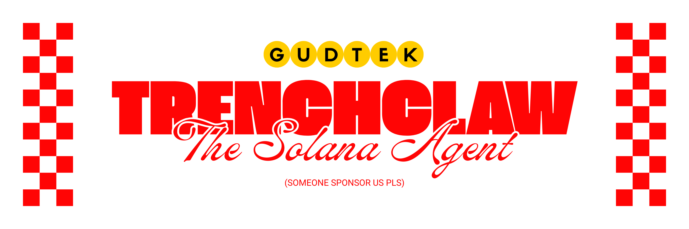
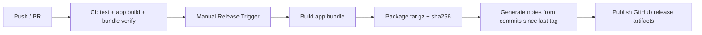
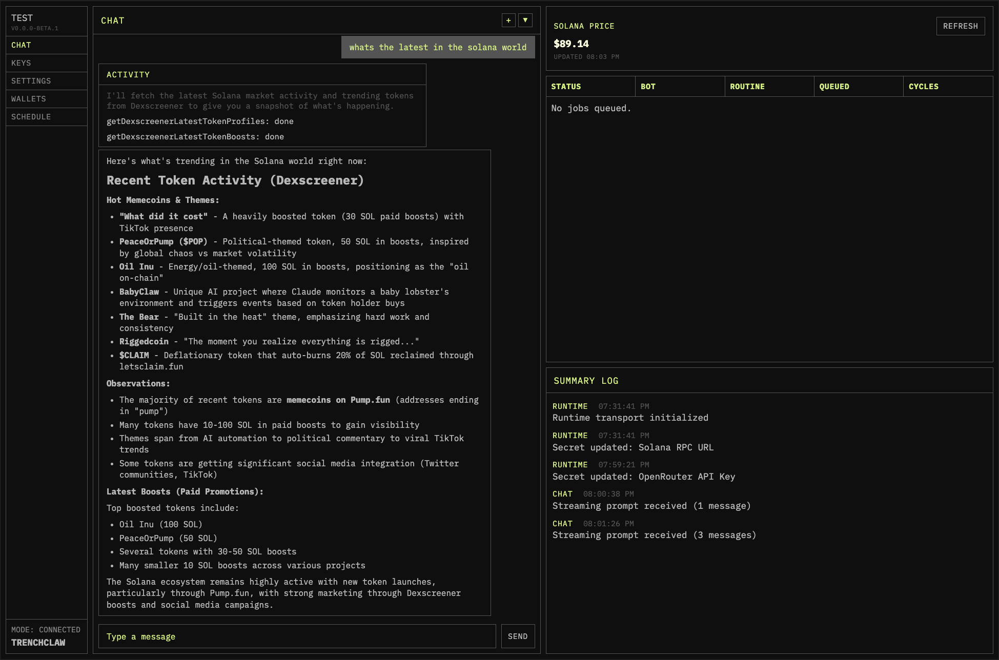
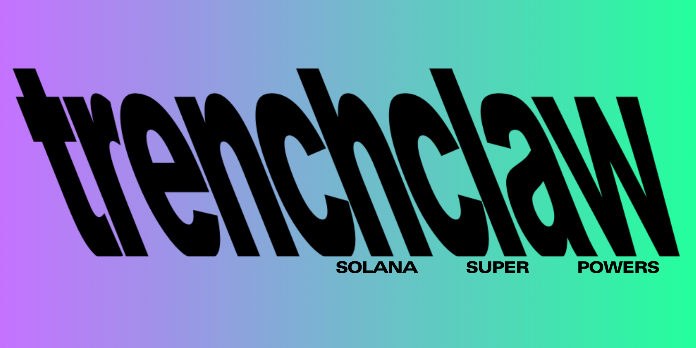

<p align="center">
  
</p>

<p align="center">
  <a href="./package.json"></a>
  <a href="https://bun.sh"></a>
  <a href="https://ai-sdk.dev/"></a>
  <a href="https://x.com/mert"></a>
  <a href="https://phantom.app/"></a>
  <a href="https://anza.xyz/"></a>
  <a href="https://github.com/anza-xyz/kit"></a>
  <a href="https://www.metaplex.com"></a>
  <a href="https://www.jup.ag"></a>
  <a href="https://www.helius.dev"></a>
  <a href="https://solana.com"></a>
  <a href="https://streamdown.ai/"></a>
  <a href="https://www.meteora.ag/"></a>
  <a href="https://ai-sdk.dev/tools-registry/bash-tool"></a>
  <a href="https://svelte.dev/"></a>
  <a href="https://bun.sh/docs/api/sqlite"></a>
</p>

## gud tek built by a long-time solami dev

Please give us a star if you're interested in seeing this project get fully built out. It will help me gauge interest. Thank you. It's gud tek built by a long-time solami dev.

# TrenchClaw

TrenchClaw is an openclaw-like agentic ai runtime for the Solana blockchain. It's a personal solana assistant that executes modular on-chain actions, runs automated trading routines, and gives operators full visibility and control from our lightweight svelte gui. This is very dangerous and will be a while before security is perfected.

Built on [`@solana/kit`](https://github.com/anza-xyz/kit) and [`Bun`](https://bun.sh) from the ground up, with GUI/mobile surfaces planned for 1.0. Zero legacy dependencies (including legacy `@solana/web3.js` v1). Functional, composable, tree-shakeable. Designed for operators who care about what ships in their binary.

Current beta keys:

- helius api key for helius-backed reads
- jupiter ultra key for swap and trigger flows
- openrouter or gateway api key for chat-driven workflows

Full architecture: [`ARCHITECTURE.md`](./ARCHITECTURE.md)

## v0.0.1 Feature Checklist

- [x] create Bun runtime monorepo
- [x] SQLite storage
- [x] Structured logging
- [x] Raw file read/write
- [x] Wallet creation and organization
- [x] RPC based data fetching
- [x] Dexscreener data fetch setup
- [x] Native Jupiter Ultra swaps
- [x] Solana Kit tx builder
- [x] Direct transfers (limited beta surface)
- [x] Bash tool and optional CLI workflows
- [x] Secure vault system for keys and secrets
- [x] Protected filesystem boundaries
- [x] Test suite
- [x] Marketing and docs website
- [x] Svelte GUI
- [x] Runner CLI
- [x] Queue and explicit scheduled routines
- [ ] CI and release flow
- [x] Public docs rollout
- [ ] Wallet and research validation

Quick links:

- [Quickstart](https://trenchclaw.vercel.app/docs)
- [Beta Capability Matrix](https://trenchclaw.vercel.app/docs/beta-capability-matrix)
- [Runtime Architecture and Boundaries](#runtime-architecture-and-boundaries)
- [Why TypeScript?](#why-typescript)
- [Why Solana Kit](#why-solana-kit)
- [TrenchClaw vs ElizaOS and Agent Kit](#trenchclaw-vs-elizaos-and-agent-kit)

WE ARE LOOKING FOR SPONSORSHIP. PLEASE SUPPORT US: 7McYcR43aYiDttnY5vDw3SR6DpUxHG8GvLzhUsYFJSyA

### THIS IS VERY UNSAFE AND THERE IS A VERY HIGH CHANCE OF SOMETHING UNEXPECTED HAPPENING IF YOU USE IT

---

## [Get Started](https://trenchclaw.vercel.app/docs)

Use the docs for install and first-run:

- [Getting Started](https://trenchclaw.vercel.app/docs/getting-started)

## Build + Release (Current Path)

Public releases ship as standalone compiled `trenchclaw` binaries. Bun is required for local development and release engineering, not for end-user installs.

```bash
# local verification
bun run release:build -- --version v0.0.0-beta.1 --run-checks

# review the release body that will be published
# releases/0.0.0-beta.1.md
```

Release publishing is manual only through the GitHub Actions `Release` workflow (`workflow_dispatch`).

- `release_mode=manual` publishes the current committed version and uses `releases/<version>.md`
- `release_mode=patch` auto-bumps the next patch version and uses GitHub-generated notes
- `release_mode=minor` auto-bumps the next minor version and uses GitHub-generated notes
- prerelease versions like `0.0.0-beta.1` should stay on `manual` mode until you intentionally cut a stable line



## Dashboard UI



---

## Runtime Architecture and Boundaries

TrenchClaw is designed as a constrained execution system, not a free-form chatbot. The architecture separates control-plane reasoning from execution-plane effects, then applies policy and filesystem constraints before any side-effecting operation.

### 1) Agent control plane (typed orchestration)

- Runtime core (`apps/trenchclaw/src/ai/core`) composes the `ActionRegistry`, `ActionDispatcher`, `PolicyEngine`, `Scheduler`, and typed event bus.
- Bootstrap wiring (`apps/trenchclaw/src/runtime/bootstrap.ts`) builds the runtime from normalized settings, registers only allowed actions, and injects adapters into action context.
- Action contracts are typed (`Action<Input, Output>`) and schema-validated before execution.
- Event emission is structured (`action:*`, `policy:block`, `queue:*`, `rpc:failover`) and persisted to SQLite/files/session logs for traceability.

### 2) Execution plane (on-chain actions + off-chain helpers)

- On-chain-capable actions live under `apps/trenchclaw/src/solana/actions/wallet-based/*` (wallet ops, transfers, swaps, and some not-yet-headline privacy flows).
- Off-chain helper actions are explicit modules under `apps/trenchclaw/src/solana/actions/data-fetch/*`:
  - RPC reads (`getAccountInfo`, `getBalance`, `getMultipleAccounts`, `getTokenMetadata`, `getTokenPrice`, `getMarketData`)
  - External API reads (`api/dexscreener.ts`)
  - Runtime introspection helpers (`data-fetch/runtime/*`)
- Adapters isolate provider specifics (`solana/lib/adapters/*`), so action logic remains provider-agnostic.

### 3) Swap modes and execution semantics

- Runtime settings normalize into two Jupiter profiles: `trading.jupiter.ultra` and `trading.jupiter.standard` (`apps/trenchclaw/src/runtime/load/loader.ts`).
- Profile selection is derived from `trading.preferredSwap` / `trading.defaultSwapProfile`; Ultra enables Ultra quote/execute permissions, Standard enables standard quote/execute permissions.
- Current runtime capability registration exposes the Ultra path (`ultraQuoteSwap`, `ultraExecuteSwap`, `ultraSwap`, `managedUltraSwap`) as the main shipped swap surface.
- Standard RPC swap actions (`quoteSwap`, `executeSwap`) exist in `wallet-based/swap/rpc/*` as modular execution primitives, with parity wiring tracked in the roadmap.

### 4) Filesystem and secret boundaries

- Filesystem access is enforced by manifest, not prompt intent (`apps/trenchclaw/src/runtime/security/filesystem-manifest.ts` + `src/ai/brain/protected/system/filesystem-manifest.yaml`).
- Default model permission is deny (`model: none`), with explicit read/write allowlists for narrow runtime paths.
- Runtime writes are scoped under the runtime-owned and instance-owned roots, with protected key material guarded by explicit policy checks (`solana/lib/wallet/protected-write-policy.ts`).

### 5) Configuration authority boundaries

- Effective settings are produced through a deterministic merge pipeline (`runtime/load/loader.ts`): base safety profile -> sanitized agent overlay -> user overlay -> protected-path enforcement -> schema validation.
- User-protected settings paths (`runtime/load/authority.ts`) prevent agent layers from silently escalating critical controls (wallet danger flags, trading limits, execution permissions, RPC/network endpoints, internet access).
- Dangerous action execution can require explicit user confirmation tokens, enforced by runtime policy before dispatch.

This design treats the agent as a policy-constrained orchestrator over explicit modules, with auditable state transitions and narrow I/O boundaries.

---

## Why TypeScript?

The TypeScript repo is heavier than minimalist alternatives. But it is currently the best and most accurate agent orchestrator for this stack. Here is why.

### What advanced agents actually require

An "advanced" agent (beyond prompt-in / prompt-out) is mostly **state + typed tool I/O + event streaming + orchestration**:

1. **Tool contracts that are both machine-readable and runtime-validatable** — the model needs a schema to decide how to call tools; your runtime needs to validate arguments before executing anything (guardrails). In practice this becomes "JSON Schema everywhere" + a local validator.
2. **A first-class event stream** — you don't just want final text; you want structured events: partial tokens, tool-call intents, tool args, tool results, retries, errors, traces.
3. **Composable middleware** — logging, redaction, policy checks, rate limits, caching, retries, circuit breakers, and tool routing.
4. **Rapid iteration** — agent quality is dominated by iteration speed: schema tweaks, tool UX, prompt/tool descriptions, trace analysis.

That set of needs strongly selects for ecosystems that treat schemas as primary artifacts, JSON as the native interchange, streaming as a first-class API, and web deployment as the default.

**Compile-time types + runtime schemas (the missing half in systems languages).**

For agents, types alone are insufficient because the LLM must see the contract and your runtime must validate untrusted tool arguments. In the Vercel AI SDK tool model, a tool declares an `inputSchema` (Zod or JSON Schema) which is both consumed by the LLM (tool selection + argument shaping) and used by the runtime to validate the tool call before `execute` runs. TypeScript is where this shines:

- Zod is ergonomic to author in TS.
- You can infer TS types from schemas (or vice versa) so the schema and the implementation don't drift.
- You can carry schema objects through routing layers without codegen.

In most systems-language stacks you end up with one of: great static typing but the schema shown to the model is hand-rolled/duplicated, or runtime validation that requires heavy codegen pipelines. **Agent code is glue code. Glue code penalizes heavy codegen.**

**The Vercel AI SDK is TypeScript-first by design.**

Vercel positions the AI SDK as "The AI Toolkit for TypeScript." Tool calling (`generateText` + `tool(...)`) is a core primitive. AI SDK strict mode behavior (tool schema compatibility, fail-fast semantics) is exactly the production detail you want in advanced agents. If your orchestration is centered on Vercel AI SDK primitives — tools, streams, UI streaming, provider adapters — the lowest-friction native language is TS.

**Structural typing + JSON-native payloads + ergonomic transforms.**

Agent payloads are structurally shaped objects: tool args, tool results, intermediate plans, traces. TS is effective because structural typing matches JSON shapes, transform pipelines are concise (`map`/`filter`/`reduce`, Zod transforms), and you can model event streams as discriminated unions and exhaustively `switch` on them (high leverage for agent traces). In systems languages you're constantly bridging between strongly typed structs and dynamic JSON, adding serialization boilerplate and versioning friction.

**The JS/TS agent ecosystem is schema-driven by default.**

Community patterns converge on "schema as first-class value," and lots of integrations assume Node/TS toolchain. Even if you don't use LangChain, this means schema-oriented integrations are plug-and-play rather than ports.

### Why systems languages underperform here

This isn't about raw capability — it's about where the complexity lives.

- **Agent orchestration is I/O-bound + integration-heavy, not CPU-bound.** Most agent loops spend time calling models, calling web APIs, waiting on DB, streaming events to UI, and validating/routing tool calls. That profile does not reward Rust/Zig/C++ the way a tight compute kernel does.
- **The hard part is contract evolution, not execution speed.** The dominant failure modes are schema drift, tool ambiguity, partial/invalid args, and inability to safely evolve tool signatures. TS + schema-first patterns reduce drift because the schema object is colocated with the code and passed through the system as data. In systems languages the "contract as data" story becomes a build-time artifact (codegen), a separate schema file that can drift, or runtime reflection that's less ergonomic than TS + Zod — all of which increase iteration cost.
- **Streaming UX is easier in the JS runtime model.** Token streaming, partial structured outputs, tool-call visualizations, reactive UI updates — the Vercel/Next ecosystem is optimized for that workflow and the AI SDK provides those primitives in the same language and runtime as your UI.

### Why many Go/Rust agent stacks are a poor fit for this environment

In this repo's environment (AI SDK orchestration + schema-first tools + Solana execution), the main risk is usually unsafe or ambiguous tool behavior, not raw compute throughput.

- **AI SDK + Zod is a single control plane in TS.** The same schema object drives model-visible tool contracts and runtime validation. In Go/Rust stacks this is usually split across generated types, JSON schemas, and adapter layers, which increases mismatch risk.
- **Fast guardrail iteration matters more than compile targets.** We frequently adjust tool descriptions, policy checks, confirmation gates, and schema constraints. TS lets these changes land in one place and ship quickly without regeneration/rebinding cycles.
- **Wallet and execution safety are runtime-policy problems.** Confirmation requirements, amount/notional limits, allowlists, idempotency keys, decision traces, and policy block reasons all live in orchestration/runtime layers. That layer benefits most from TS-native schema + event tooling.
- **Most Go/Rust "agent frameworks" optimize for infra shape, not operator safety UX.** They can be excellent for service performance, but often require extra custom work to match strict tool schemas, rich stream events, and interactive safety controls expected in trading/operator systems.

Systems languages still fit extremely well behind strict boundaries (signing, parsing, deterministic execution, high-throughput services). They are usually not the fastest path for the orchestrator that must remain tightly coupled to AI SDK tool contracts and streaming UI behavior.

### The practical synthesis

The strongest default architecture for this stack is:

> **TypeScript orchestrator (agent brain) + optional systems-language executors (muscle, only when justified)**

- **TS owns:** tool schemas and validation, orchestration loop and routing, streaming events and UI integration, persistence format/versioning of traces, provider adapters (AI SDK).
- **Rust/Zig/Go (optional) own:** cryptography-heavy or latency-critical primitives (signing, parsing), sandboxed tool executables, deterministic compute kernels, RPC services behind strict schemas.

This preserves agentic flow (fast iteration, schema-first tooling, Vercel AI SDK integration) while using systems languages only where they actually dominate. If no component is bottlenecked by throughput, latency, or native constraints, an all-TypeScript implementation is usually the simpler and better default.

### Why Solana Kit is an advantage in this architecture

`@solana/kit` is not just a Solana SDK choice here; it improves the same agentic properties this TypeScript stack optimizes for:

- **Schema-aligned tool boundaries:** Kit's typed RPC, transactions, and signer APIs map cleanly into JSON Schema/Zod-based tool contracts.
- **Safer orchestration loops:** functional, immutable transaction composition reduces hidden mutation bugs inside multi-step tool pipelines.
- **Lower drift risk:** strict TS types around accounts, signers, blockhash lifetimes, and lamports (`bigint`) keep model-selected tool args closer to executable reality.
- **Better iteration velocity:** composable modular imports and generated clients (Codama) make it faster to add or refine Solana actions without rewriting plumbing.

### When TypeScript is effectively required

TS is effectively required when all are true:

1. Orchestration is centered on Vercel AI SDK primitives (tools, streams, strict-mode behavior).
2. Tool contracts evolve rapidly and must stay aligned across model-visible schema, runtime validation, and implementation types.
3. The product depends on streaming-first UX in a Next/Vercel-style deployment surface.

Under these constraints, systems-language orchestrators often re-create TS-native schema + streaming + UI integration layers from scratch.

---

## Why Solana Kit

TrenchClaw does not use [`@solana/web3.js`](https://www.npmjs.com/package/@solana/web3.js) v1. It uses [`@solana/kit`](https://github.com/anza-xyz/kit) (formerly web3.js v2), the official ground-up rewrite from [Anza](https://anza.xyz).

The old `@solana/web3.js` is a monolithic, class-based SDK. Its `Connection` class bundles every RPC method into a single non-tree-shakeable object. Whether you call one method or fifty, your users download the entire library. It relies on third-party crypto polyfills, uses `number` where `bigint` belongs, and provides loose TypeScript types that let bugs slip to runtime.

Kit is the opposite. It is functional, composable, zero-dependency, and fully tree-shakeable. It uses the native [Web Crypto API](https://developer.mozilla.org/en-US/docs/Web/API/Web_Crypto_API) for Ed25519 signing instead of userspace polyfills. It uses `bigint` for lamport values. It catches missing blockhashes, missing signers, and wrong account types at compile time, not after your transaction fails on-chain.

### The numbers

| | `@solana/web3.js` v1 | `@solana/kit` v6 |
|---|---|---|
| Architecture | Monolithic `Connection` class | 28 modular packages |
| Bundle (minified) | ~450 KB | ~100 KB compressed |
| Tree-shakeable | No | Yes |
| Dependencies | Multiple (bn.js, borsh, buffer, etc.) | Zero |
| Crypto | Userspace polyfills | Native Web Crypto API (Ed25519) |
| Large numbers | `number` (lossy above 2^53) | `bigint` (safe for lamports) |
| Type safety | Loose | Strict (compile-time signer/blockhash/account checks) |
| Confirmation latency | Baseline | ~200ms faster in real-world testing |
| Maintenance | Security patches only | Active development by Anza |

Real-world impact: the [Solana Explorer](https://explorer.solana.com) homepage dropped its bundle from 311 KB to 226 KB (a **26% reduction**) after migrating to Kit.

### What changes in practice

**No more `Connection` class.** Kit replaces it with `createSolanaRpc()` and `createSolanaRpcSubscriptions()` — lightweight proxy objects that only bundle the methods you actually call. Whether your RPC supports 1 method or 100, the bundle size stays the same.

**No more `Keypair`.** Kit uses `CryptoKeyPair` from the Web Crypto API via `generateKeyPairSigner()`. Private keys never have to be exposed to the JavaScript environment. Signing happens through `TransactionSigner` objects that abstract the mechanism — hardware wallet, browser extension, CryptoKey, or noop signer for testing.

**No more mutable transactions.** Kit uses a functional `pipe()` pattern to build transaction messages. Each step returns a new immutable object with an updated TypeScript type, so the compiler tracks what your transaction has (fee payer, blockhash, instructions, signers) and what it's missing — before you ever hit the network.

```typescript
import { pipe, createTransactionMessage, setTransactionMessageFeePayerSigner,
  setTransactionMessageLifetimeUsingBlockhash, appendTransactionMessageInstructions,
  signTransactionMessageWithSigners } from '@solana/kit';

const tx = pipe(
  createTransactionMessage({ version: 0 }),
  (tx) => setTransactionMessageFeePayerSigner(payer, tx),
  (tx) => setTransactionMessageLifetimeUsingBlockhash(blockhash, tx),
  (tx) => appendTransactionMessageInstructions([transferInstruction], tx),
);

const signed = await signTransactionMessageWithSigners(tx);
```

**No more hand-rolled instruction builders.** Program interactions use generated clients from [Codama](https://github.com/codama-idl/codama) IDL files. Drop an IDL JSON in `lib/client/idl/`, run codegen, get typed instruction builders, account decoders, PDA helpers, and error enums. TrenchClaw imports from these generated clients — never constructs instructions manually.

---

## TrenchClaw vs ElizaOS and Agent Kit

If you are evaluating Solana agent stacks today, the practical split is this: TrenchClaw is built directly on `@solana/kit`, while many existing agent ecosystems still rely on legacy `@solana/web3.js` integrations.

| | TrenchClaw | ElizaOS (typical Solana plugin setups) | Agent Kit style starter stacks |
|---|---|---|---|
| Primary Solana SDK | `@solana/kit` | Commonly `@solana/web3.js`-based plugins/adapters | Commonly `@solana/web3.js` wrappers |
| API style | Functional + composable | Framework/plugin driven | Framework/toolkit driven |
| Tree-shaking | Strong (modular Kit packages) | Often weaker due to `Connection`-style clients | Often weaker due to broad utility bundles |
| Type guarantees around tx composition | Strong compile-time checks in Kit pipeline | Depends on plugin quality | Depends on toolkit layer |
| Runtime focus | Terminal-first operator runtime | Multi-platform agent framework | General AI-agent developer UX |

### Cross-framework context (same benchmark source)

| Framework/runtime | Throughput (req/s) |
|---|---:|
| Rust + Axum | 21,030 |
| Bun + Fastify | 20,683 |
| ASP.NET Core | 14,707 |
| Go + Gin | 3,546 |
| Python + FastAPI (Uvicorn) | 1,185 |

### Storage: Bun SQLite

TrenchClaw uses Bun's built-in SQLite (`bun:sqlite`) for runtime jobs, receipts, policy/decision traces, market/cache data, and chat persistence (`conversations`, `chat_messages`). It keeps state local, restart-safe, and dependency-light.

Schema is Zod-first and auto-synced on boot:

- Row/table schema source of truth: `src/runtime/storage/sqlite-schema.ts`
- Zod-to-SQL mapping + boot sync: `src/runtime/storage/sqlite-orm.ts`
- Runtime prints a compact schema snapshot at boot for operator/model context

Runtime log/data layout is split by purpose under `src/ai/brain/db/`:

- `runtime/`: SQLite DB + runtime event files
- `sessions/`: session index + JSONL transcript stream
- `summaries/`: compact per-session markdown summaries
- `system/`: daily system/runtime logs
- `memory/`: daily + long-term memory notes

### Why this stack here

Solana Kit, Jupiter integration, and Codama-generated clients are all TypeScript-native in this repo. Bun gives fast startup, strong HTTP performance, and native TypeScript execution while keeping the codebase in one language.

---

## What It Does

- Registers and dispatches typed Solana actions with policy gates, retries, and idempotency
- Ships managed wallet reads, wallet management, Dexscreener research, Jupiter Ultra swaps, and direct Jupiter Trigger order flows
- Composes explicit action sequences, queued jobs, and narrow scheduled swap flows
- Persists runtime state + chat history in Bun SQLite (restart-safe)
- Auto-syncs SQLite schema from Zod table specs on boot (no manual version bump for additive changes)
- Emits structured events on a typed bus consumed by CLI logs and future alerting
- Exposes an operator control surface through the CLI
- Keeps agent knowledge (soul, rules, skills, outside context) in `src/ai/brain/`, loaded by orchestration in `src/ai/`
- Uses RPC/Jupiter/token-account adapters so the runtime is provider-agnostic (swap Helius for QuickNode without touching action code)
- Generates typed program clients from Anchor IDLs via [Codama](https://github.com/codama-idl/codama) — no hand-rolled instruction builders

Current public beta does not promise a broad autonomous strategy engine yet. Privacy flows, broad trigger automation, and non-Ultra public swap paths should be treated as coming soon.

## Download Dependencies

Use the runner bootstrap script to install or upgrade the local development toolchain:

```bash
sh ./apps/runner/scripts/bootstrap-deps.sh
```

That dev helper manages:

- Bun
- Solana CLI
- Helius CLI

Public standalone installs do not require Bun, Solana CLI, or Helius CLI for first launch. Install those CLIs only when a workflow explicitly needs them.

Manual equivalents (if you need them):

```bash
# Bun (macOS/Linux)
curl -fsSL https://bun.sh/install | bash

# Solana CLI via Anza installer (macOS/Linux, stable channel)
sh -c "$(curl -sSfL https://release.anza.xyz/stable/install)"

# Helius CLI
bun add -g helius-cli@latest
```

Verify everything is installed:

```bash
bun --version
solana --version
helius --version
```

Update commands:

```bash
bun upgrade
agave-install update
bun add -g helius-cli@latest
```

## Unified App Runner (Local)

Use one command to start the runtime and GUI together:

```bash
bun install
bun run app:build
bun run start
```

What `bun run start` does:

- Starts the dedicated runner (`apps/runner`) which then starts the core runtime process (`apps/trenchclaw runtime:start`)
- Rebuilds missing `.runtime-state/generated/` artifacts on startup, and you can force a full refresh with `TRENCHCLAW_BOOT_REFRESH_CONTEXT=1` / `TRENCHCLAW_BOOT_REFRESH_KNOWLEDGE=1`
- Starts runtime API on localhost
- Serves GUI from static `apps/frontends/gui/dist`
- Proxies `/api/*` from GUI server to runtime server
- Prompts `launch GUI now?` and opens browser after Enter (type `skip` to keep runtime CLI-only)
- Supports `bun run start -- doctor` for local preflight checks

Local development still uses Vite:

```bash
bun run gui:dev
```

---

## v1.0 Feature Checklist

- [ ] Simulation and paper trading
- [ ] Metrics and tracing
- [ ] Trigger engine (time, price, on-chain)
- [ ] Live routine execution (DCA, swing, % buy/sell, sniper)
- [ ] Non-Ultra RPC swap parity
- [ ] Production-safe trigger scheduling
- [ ] Retry/restart idempotency
- [ ] Multi-wallet support with limits
- [ ] Portfolio and PnL tracking
- [ ] Risk controls (size, slippage, drawdown)
- [ ] Runtime and trade alerts
- [ ] Operator controls (pause, resume, kill switch)
- [ ] External API controls (auth, rate limits, typed contracts)
- [ ] Production key management and rotation
- [ ] Storage maintenance and backup/restore
- [ ] Historical market data ingestion
- [ ] Reproducible backtests and simulations
- [ ] Performance and execution reporting
- [ ] Solana data source redundancy
- [ ] Failure recovery and dead-letter handling
- [ ] Full test coverage (unit/integration/scenario/soak)
- [ ] Release workflow and CI quality gates
- [] Privacy transfer via Privacy Cash

---

<p align="center">
  
</p>

## License

TBD

# use at your own risk
