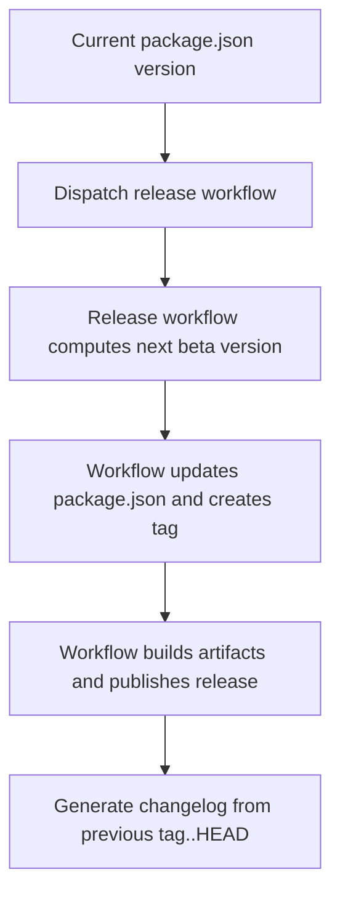

# TrenchClaw Versioning Strategy

## Current Baseline

- Root version source of truth: `package.json -> version`
- Current baseline: `0.0.0-beta.1`

## Increment Rules

- `beta`
  - `0.0.0-beta.N` -> `0.0.0-beta.(N+1)`
  - no stable promotion yet
  - no patch/minor/major bumping yet

## Commands

Dry-run only (default behavior):

```bash
bun run version:next
```

Apply to `package.json`:

```bash
TRENCHCLAW_ALLOW_VERSION_WRITE=1 bun run version:apply
```

## Release Notes Coupling

Release notes continue to use commit ranges from previous `v*` tag to `HEAD`.
Tag output from version commands is returned as `nextTag` for release workflow use.

## Release Gate

The release workflow has no inputs.

- it always advances `0.0.0-beta.N` to `0.0.0-beta.(N+1)`
- it updates `package.json`, commits it, tags it, and publishes the release
- Existing tags are rejected before build/publish starts

## Flow


