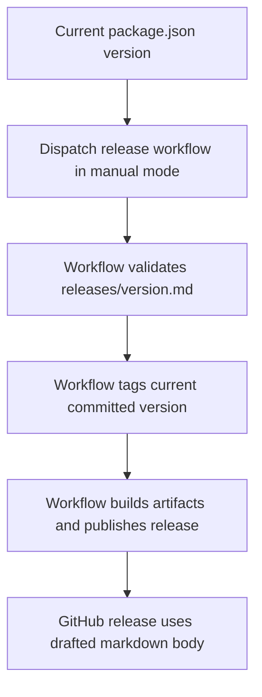

# TrenchClaw Versioning Strategy

## Current Baseline

- Root version source of truth: `package.json -> version`
- Current baseline: `0.0.0-beta.2`

## Increment Rules

- `beta`
  - `0.0.0-beta.N` -> `0.0.0-beta.(N+1)`
  - no stable promotion yet
  - no patch/minor/major bumping yet

## Commands

Dry-run only (default behavior):

```bash
bun run version:next
```

Apply to `package.json`:

```bash
TRENCHCLAW_ALLOW_VERSION_WRITE=1 bun run version:apply
```

## Release Notes Coupling

Manual prerelease notes live in `releases/<version>.md`.
Tag output from version commands is returned as `nextTag` for release workflow use.

## Release Gate

The release workflow uses `workflow_dispatch` with explicit release modes.

- prerelease versions like `0.0.0-beta.N` should use `release_mode=manual`
- `manual` publishes the current committed version already present in `package.json`
- `manual` requires `releases/<version>.md`
- `patch` and `minor` are for stable releases, not the beta track
- existing tags are rejected before build/publish starts

## Flow


