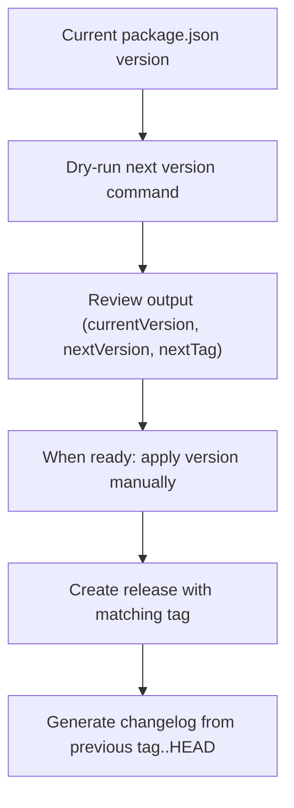

# TrenchClaw Versioning Strategy (Ready, Not Activated)

This repo now has versioning tooling prepared, but nothing auto-bumps versions yet.

## Current Baseline

- Root version source of truth: `package.json -> version`
- Current baseline: `0.0.1-beta.1`

## Increment Rules

- `auto`
  - stable `X.Y.Z` -> `X.Y.(Z+1)`
  - beta `X.Y.Z-beta.N` -> `X.Y.Z-beta.(N+1)`
- `beta`
  - stable `X.Y.Z` -> `X.Y.(Z+1)-beta.1`
  - beta `X.Y.Z-beta.N` -> `X.Y.Z-beta.(N+1)`
- `patch`
  - stable `X.Y.Z` -> `X.Y.(Z+1)`
  - beta `X.Y.Z-beta.N` -> `X.Y.Z` (promote beta to stable)

## Commands

Dry-run only (default behavior):

```bash
bun run version:next
bun run version:next:beta
bun run version:next:patch
```

Apply to `package.json` (manual only, no CI auto-bump):

```bash
TRENCHCLAW_ALLOW_VERSION_WRITE=1 bun run version:apply:auto
TRENCHCLAW_ALLOW_VERSION_WRITE=1 bun run version:apply:beta
TRENCHCLAW_ALLOW_VERSION_WRITE=1 bun run version:apply:patch
```

## Release Notes Coupling

Release notes continue to use commit ranges from previous `v*` tag to `HEAD`.
Tag output from version commands is returned as `nextTag` for release workflow use.

## Flow


