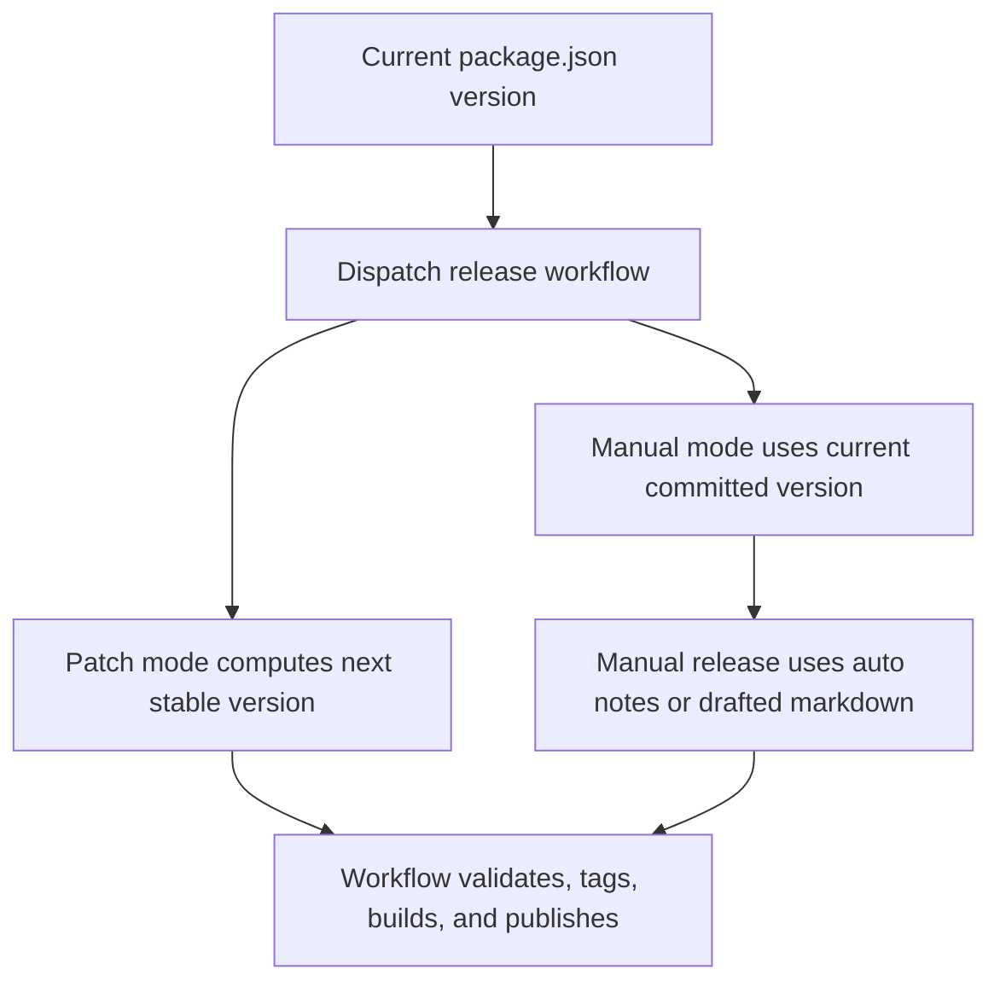

# TrenchClaw Versioning Strategy

## Current Baseline

- Root version source of truth: `package.json -> version`
- Current baseline: use the committed `package.json` version

## Increment Rules

- `patch`
  - stable versions increment normally: `0.0.0` -> `0.0.1`
  - prerelease versions promote to the matching stable version: `0.0.0-beta.4` -> `0.0.0`

- `minor`
  - stable versions increment normally: `0.0.0` -> `0.1.0`
  - prerelease versions must be promoted to stable before a minor bump

- `beta`
  - prerelease numbers can start at `beta.0`
  - existing prerelease versions can still increment in place: `0.1.0-beta.0` -> `0.1.0-beta.1`
  - beta support remains for compatibility, but it is no longer the default release flow

## Commands

Dry-run only (default behavior):

```bash
bun run version:next
```

Preview the next stable patch release explicitly:

```bash
bun run version:next -- --strategy patch
```

Apply to `package.json`:

```bash
TRENCHCLAW_ALLOW_VERSION_WRITE=1 bun run version:apply
```

## Release Notes Coupling

Release notes live in tracked `releases/<version>.md` files, and the release workflow rewrites the file for the version it is publishing.
Tag output from version commands is returned as `nextTag` for release workflow use.

## Release Gate

The release workflow uses `workflow_dispatch` with explicit release modes.

- `manual` publishes the current committed version already present in `package.json`
- the workflow always writes `releases/<version>.md` before tagging and publishing
- `patch` is the default day-to-day release path
- `minor` remains available when you intentionally want a wider stable step
- existing tags are rejected before build/publish starts

## Flow


