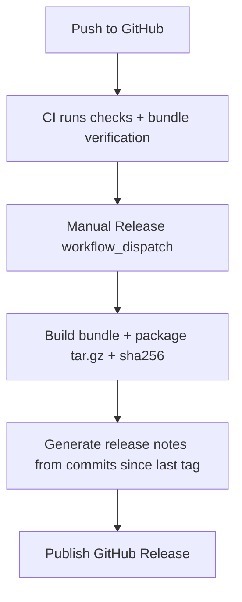

This guide is for the current release path: app bundle (not final native binary yet).

You install one bundle that already includes:
- GUI build
- Runner
- Core runtime source

You do **not** need `.env` files.

## Requirements

- Bun `1.3.10+`
- macOS or Linux shell with `curl` and `tar`

No Solana CLI or Helius CLI is required for normal app usage.

## Install (Consumer Path)

Run the installer script:

```bash
curl -fsSL https://raw.githubusercontent.com/trenchclaw/trenchclaw/main/scripts/install-trenchclaw.sh | sh
```

Pin a specific release tag:

```bash
curl -fsSL https://raw.githubusercontent.com/trenchclaw/trenchclaw/main/scripts/install-trenchclaw.sh | \
  TRENCHCLAW_VERSION=v0.0.2 \
  sh
```

What this does:
1. Installs Bun if needed.
2. Downloads the TrenchClaw app bundle.
3. Installs a `trenchclaw` launcher into `~/.local/bin`.
4. Runs bundle dependency setup on first launch.

Then start:

```bash
trenchclaw
```

## Configure In-App

On first use, configure values through the app GUI/runtime flow:
- RPC endpoint(s)
- LLM provider key + model
- Wallet/key workflows

Do not use `.env` setup for this consumer path.

## Source/Dev Path (Maintainers)

If you are developing from source:

```bash
bun install
bun run launch:dev
```

## Build and Verify the User Bundle

These are the exact commands used to prepare distributable app output:

```bash
bun run app:clean
bun run app:build
bun run bundle:verify
```

Create a release artifact:

```bash
bun run release:package -- --version v0.0.2
```

Generate release notes from unreleased commits:

```bash
bun run release:notes -- --version v0.0.2 --output dist/release/release-notes.md
```

## Release Flow

Releases are manual (not on every push).



## Troubleshooting

### `trenchclaw: command not found`

Add local bin to your shell path:

```bash
export PATH="$HOME/.local/bin:$PATH"
```

### Bun missing or outdated

```bash
bun --version
```

Re-run installer if needed.

### Launcher says `Run ./setup.sh first`

Run:

```bash
~/.local/share/trenchclaw/current/setup.sh
```

Then re-run:

```bash
trenchclaw
```
