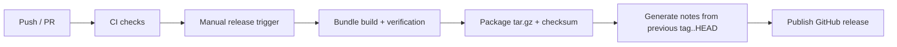

This page documents the current release process (app bundle phase, pre-native-binary).

## What Ships

Each app-bundle release includes:
- GUI build output
- Runner build output
- Core runtime tracked source

Each release excludes local/user-specific files:
- `vault.json`
- keypair files
- wallet library state files
- runtime DB/session/event data
- `.env` files

## Local Commands

```bash
bun run app:clean
bun run app:build
bun run bundle:verify
bun run release:package -- --version vX.Y.Z
bun run release:notes -- --version vX.Y.Z --output dist/release/release-notes.md
```

## CI + Manual Release



## Changelog Behavior

Release notes are generated from commit subjects in the unreleased range:
- previous version tag (`v*`) to `HEAD`
- grouped into entries (features, fixes, docs, CI, etc.)

That gives each release a changelog containing only commits not already announced in a prior tagged release.
