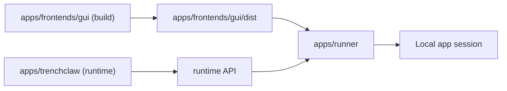

TrenchClaw runs as a split architecture: runtime core plus GUI served by a runner.

## Core Packages

- `apps/trenchclaw`: core runtime
- `apps/frontends/gui`: web UI
- `apps/runner`: process launcher and static server for GUI assets

## Runtime Flow



The runner serves GUI assets and bridges UI requests to the runtime API.

## Build Outputs

- Runner build: `apps/runner/dist`
- GUI build: `apps/frontends/gui/dist`
- App bundle output: `dist/app`

## Local Commands

```bash
bun run app:build
bun run start
```

For GUI-only iteration:

```bash
bun run gui:dev
```

## Important Path Note

`apps/frontends/runner` is legacy and not a valid source package path.
